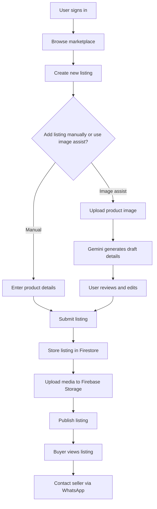
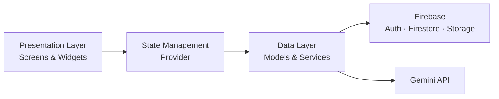

# COMAT

COMAT is a mobile marketplace application built for university communities. It provides a structured alternative to informal buying and selling through group chats by giving users a dedicated place to create listings, browse available items, and contact sellers.

The application is built with Flutter and Firebase and includes optional AI-assisted listing creation using Google Gemini.

## Features

- Create and manage marketplace listings
- Browse available products by category
- Authenticate users with Google Sign-In
- Store product and user data in Cloud Firestore
- Upload and manage listing images with Firebase Storage
- Contact sellers through WhatsApp
- Generate draft listing details from product images using Gemini
- Manage application state with Provider
- Organize application logic using a layered project structure

## AI-Assisted Listing Creation

COMAT includes an image-assisted listing workflow intended to reduce repetitive data entry.

A seller can provide a product image, which is sent to Gemini to generate draft listing information such as:

- Product name
- Description
- Suggested category
- Draft pricing information

The generated information remains editable before the listing is published.

This feature is designed as an assistive workflow rather than an automated publishing system.

## Application Flow



## Tech Stack

### Mobile Application
- Flutter
- Dart

### Backend Services
- Firebase Authentication
- Cloud Firestore
- Firebase Cloud Storage

### AI Integration
- Google Generative AI
- Gemini 1.5 Flash

### State Management
- Provider

## Architecture



The codebase separates presentation, state management, data models, and external services so the application is easier to maintain and extend.

## Project Structure

```text
lib/
├── core/
│   ├── configuration
│   ├── theme
│   └── shared utilities
│
├── data/
│   ├── models
│   └── services
│       ├── Firebase
│       └── Gemini
│
├── presentation/
│   ├── authentication
│   ├── listings
│   ├── profile
│   └── shared widgets
│
└── main.dart
```

## Getting Started

### Requirements

Before running the project, ensure you have:

- Flutter installed
- A Firebase project
- A Gemini API key
- Android Studio, Xcode, or another supported Flutter development environment

### 1. Clone the Repository

```bash
git clone git@github.com:fskamau/comat.git
cd comat
flutter pub get
```

### 2. Configure Environment Variables

Create a `.env` file based on `.env.example`:

```text
GEMINI_API_KEY=your_key_here
```

Do not commit API keys or other credentials to the repository.

### 3. Configure Firebase

Create a project in Firebase and register the required Android and/or iOS application.

For Android, add:

```text
android/app/google-services.json
```

For iOS, add:

```text
ios/Runner/GoogleService-Info.plist
```

These files are intentionally excluded from the repository.

### 4. Configure Firestore

Create the required Firestore collections for application data, including:

```text
products
users
```

Configure security rules based on your authentication and access requirements.

### 5. Run the Application

```bash
flutter run
```

## Security

Sensitive configuration files and credentials are not stored in the repository.

The project excludes files such as:

```text
.env
google-services.json
GoogleService-Info.plist
```

API keys should be managed through environment variables or an appropriate secrets-management solution.

## Development Status

COMAT is a portfolio and development project exploring mobile marketplace architecture, Firebase-backed application workflows, and practical integration of generative AI into a user-facing feature.

Future improvements may include:

- Improved search and filtering
- Listing moderation
- Better seller profiles
- Saved listings
- Messaging improvements
- Additional listing validation
- Expanded automated testing

## License

This project is licensed under the MIT License. See the `LICENSE` file for details.
